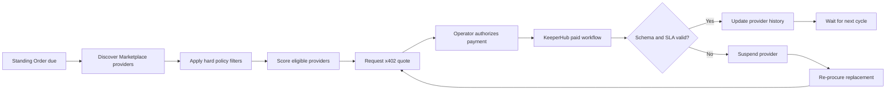
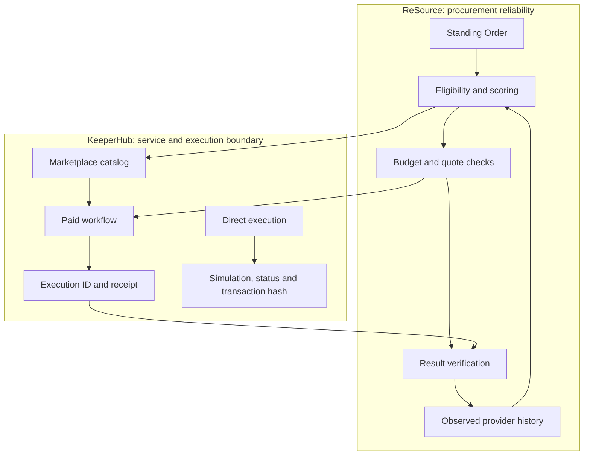
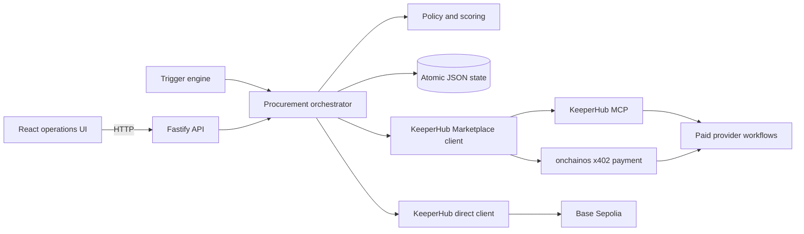

<p align="center">
  
</p>

# ReSource

**The self-healing buyer for agent services.**

ReSource is a demand-side procurement runtime for agents. A persistent **Standing Order** defines the required service, price ceiling, spend limit, latency SLA, reliability floor, cadence and failover policy. ReSource discovers eligible KeeperHub Marketplace providers, selects one deterministically, obtains an x402 quote, requests payment authorization, verifies the paid result and replaces a provider when observed performance falls outside policy.

KeeperHub supplies the Marketplace, paid workflow and onchain execution boundaries. ReSource owns the buyer-side decision: which provider is eligible, what may be spent, whether the returned result is acceptable and when the requirement must be sourced again.

**[How it works](#procurement-loop) · [KeeperHub integration](#keeperhub-integration) · [Live proof](#live-execution-proof) · [Run locally](#run-locally) · [Full architecture](docs/ARCHITECTURE.md)**

> Current scope: one transaction-risk Standing Order, two live KeeperHub Marketplace listings, x402 settlement on Base, and a direct KeeperHub execution proof on Base Sepolia. The repository also includes a no-funds demo mode.

## Live execution proof

These identifiers were returned by the implemented KeeperHub paths. The direct proof is the hackathon's public onchain transaction; the x402 rows are paid Marketplace service calls recorded by the buyer.

| Evidence | Network | Amount | KeeperHub execution | Transaction |
| --- | --- | ---: | --- | --- |
| Direct execution proof | Base Sepolia (`84532`) | Zero-value self-transfer | `zw6ra484fc7g90jrqhhzk` | [`0x3c0124...e3c302`](https://sepolia.basescan.org/tx/0x3c0124ac14d8e18bb5bdcb65ad0196da463522fa562f3c7e5f5d55710ae3c302) |
| Atlas Marketplace purchase | Base (`8453`) | 0.05 USDC | `mqg3c8bkevd9l4uw32bg9` | [`0x9fa010...ea3dbc`](https://basescan.org/tx/0x9fa0109c86a4c8c03a7dbb56291f832ef44af9b13b5b3d7204fd6cf9eeea3dbc) |
| Atlas recovery purchase | Base (`8453`) | 0.05 USDC | `05g7axe7l67iaoy6f88ir` | [`0x474eb2...1e7916`](https://basescan.org/tx/0x474eb27192e8e78c460149e539d20582b05383a03222e5ef8f584666e81e7916) |

**Demo video:** TODO before submission: add the public demo video URL.

The direct path is implemented in [`server/direct-execution.ts`](server/direct-execution.ts). It fetches the KeeperHub wallet, simulates a fixed Base Sepolia self-transfer, requires a separate broadcast action, polls KeeperHub to a terminal state and stores the execution ID, hash and explorer URL. No transaction hash in this document is fabricated.

## Why ReSource exists

Most agents bind a service requirement to one provider in code. If that provider gets slower, becomes too expensive, returns malformed data or drops below an SLA, the requirement remains coupled to the failing integration.

ReSource makes the requirement persistent and the supplier replaceable. Selection is repeated against the Standing Order and locally observed provider history. A provider failure changes future eligibility instead of becoming an isolated retry against the same endpoint.

## Procurement loop



The scheduler can trigger discovery and selection automatically. In the live Marketplace path it stops at `awaiting_payment`; every fresh or refreshed quote must be authorized from the dashboard. Demo mode executes without funds and can complete the loop unattended.

## Standing Order

The shipped order is defined in [`src/data/demo.ts`](src/data/demo.ts) and persisted server-side after edits:

```json
{
  "id": "SO-001",
  "service": "Transaction Risk Intelligence",
  "description": "Assess transaction calldata risk before onchain execution.",
  "intervalMinutes": 10,
  "maxPrice": 0.06,
  "dailyBudget": 2,
  "maxLatencyMs": 20000,
  "minReliability": 0.95,
  "automaticFailover": true,
  "status": "active"
}
```

Before scoring, the buyer rejects a candidate when the order is paused, the provider is suspended, price exceeds `maxPrice`, accumulated spend plus price exceeds `dailyBudget`, latency exceeds `maxLatencyMs`, or observed reliability falls below `minReliability`.

Eligible candidates receive this deterministic score:

```text
priceScore       = 1 - provider.price / order.maxPrice
latencyScore     = 1 - provider.latencyMs / order.maxLatencyMs

score = 0.40 * priceScore
      + 0.40 * provider.reliability
      + 0.20 * latencyScore
```

The score is rounded to three decimal places. Highest score wins; equal scores retain catalog order.

## What ReSource is, and is not

| System type | What it decides | ReSource's distinction |
| --- | --- | --- |
| Single-provider agent | How to call one configured service | ReSource can disqualify and replace the provider. |
| x402 payment client | How to satisfy a payment challenge | ReSource decides whether the service and quote satisfy buyer policy before authorization. |
| Marketplace | Which services are listed | KeeperHub owns listings; ReSource is the policy-controlled buyer of those listings. |
| Budget guard | Whether one purchase is affordable | Budget is one hard filter inside discovery, scoring, verification and re-procurement. |
| Transaction retry layer | How to land a chosen transaction | KeeperHub owns execution status; ReSource revisits which service should be bought. |

## KeeperHub integration

| KeeperHub surface | Implemented role | Source |
| --- | --- | --- |
| MCP | Opens a session and calls `search_workflows` / `get_workflow_listing` for configured public slugs. | [`server/marketplace.ts`](server/marketplace.ts) |
| Marketplace | Supplies the live Sentinel and Atlas risk-provider listings and payable workflow endpoint. | [`server/marketplace.ts`](server/marketplace.ts) |
| x402 + Agentic Wallet | Quotes the public workflow, then invokes `onchainos payment pay` only after explicit confirmation. | [`server/marketplace.ts`](server/marketplace.ts) |
| Workflow REST API | Provides an organization-workflow adapter using execute and wait endpoints. It is implemented as a separate compatibility path, not the default Marketplace branch in `server/index.ts`. | [`server/adapters.ts`](server/adapters.ts) |
| Direct execution | Simulates and broadcasts a zero-value Base Sepolia self-transfer, then polls for hash/link evidence. | [`server/direct-execution.ts`](server/direct-execution.ts) |
| Execution records | ReSource persists KeeperHub execution IDs, x402 hashes, direct-proof evidence and errors in its own state record. | [`server/orchestrator.ts`](server/orchestrator.ts) |

MPP is not implemented. Marketplace payments use x402 through the installed `onchainos` CLI.

### Two reliability layers



KeeperHub reports whether its workflow or direct execution completed. ReSource interprets that evidence in the context of a standing requirement: result shape, observed latency, budget, reliability and supplier eligibility.

On a paid result failure, ReSource records the charge if the payment settled, marks the provider ineligible and starts a replacement cycle when `automaticFailover` is enabled. The replacement quote still requires a new authorization.

## Architecture



The orchestrator serializes every state-changing operation in one process. Procurement rules are shared by server and browser, while payment, credentials, persistence and KeeperHub calls remain server-only.

For component contracts, sequence diagrams, failure behavior, state models and source mapping, read **[Full Architecture → docs/ARCHITECTURE.md](docs/ARCHITECTURE.md)**.

## Repository map

```text
ReSource/
├── server/
│   ├── app.ts                  # Fastify routes and CORS boundary
│   ├── orchestrator.ts         # Serialized procurement and recovery lifecycle
│   ├── marketplace.ts          # KeeperHub MCP discovery and x402 wallet calls
│   ├── direct-execution.ts     # Simulate, broadcast and poll direct proof
│   ├── adapters.ts             # Demo and organization-workflow adapters
│   ├── scheduler.ts            # Interval trigger and stable schedule keys
│   ├── store.ts                # Atomic JSON and in-memory test stores
│   └── *.test.ts               # API, orchestration and scheduler tests
├── src/
│   ├── App.tsx                 # Dashboard state and operator actions
│   ├── WorkspaceViews.tsx      # Orders, providers, executions and settings
│   ├── lib/procurement.ts      # Eligibility, scoring and failure updates
│   ├── data/demo.ts            # Reproducible order and provider fixtures
│   └── types.ts                # Shared state and domain contracts
├── docs/
│   ├── ARCHITECTURE.md         # Complete system design
│   ├── KEEPERHUB.md            # KeeperHub boundary notes
│   └── KEEPERHUB_FRICTION_LOG.md
├── data/                       # Local runtime.json (generated and gitignored)
├── scripts/                    # Render wallet export and startup checks
├── Dockerfile                  # Live Render runtime with verified onchainos CLI
├── render.yaml                 # Live KeeperHub API deployment definition
├── vercel.json                 # Vite web deployment definition
└── package.json
```

This is a single npm package, not a monorepo. It contains no smart contracts or provider implementations; the providers are external KeeperHub Marketplace workflows.

## Run locally

### Prerequisites

- Node.js 24 and npm. Render is pinned to Node `24.15.0`.
- For demo mode: no wallet, API key or funds.
- For KeeperHub mode: a KeeperHub API key, buyer address, access to the configured Marketplace listings and `onchainos` CLI with a usable Agentic Wallet account.

### Demo mode

```bash
npm ci
cp .env.example .env
npm run dev
```

The example environment defaults to `EXECUTION_MODE=demo`. Open `http://127.0.0.1:5173`, enter the workspace, then:

1. Run a procurement cycle. Sentinel wins; Veridian is rejected by policy.
2. Inject the controlled provider failure. Sentinel is suspended.
3. Observe Atlas become the replacement and the recovery appear in metrics and audit history.

The API listens on `http://127.0.0.1:8787`. A direct API cycle requires an idempotency key:

```bash
curl -X POST http://127.0.0.1:8787/api/standing-orders/SO-001/run \
  -H 'idempotency-key: local-demo-1'
```

### KeeperHub mode

Set the required values in `.env`, ensure `onchainos` is installed and authenticated, then run the same development command:

```text
EXECUTION_MODE=keeperhub
KEEPERHUB_API_URL=https://app.keeperhub.com/api
KEEPERHUB_API_KEY=kh_...
RESOURCE_BUYER_ADDRESS=0x...
KEEPERHUB_MARKETPLACE_SLUGS=resource-sentinel-risk-provider,resource-atlas-risk-provider
```

```bash
npm run dev
```

The live cycle discovers listings and produces a quote. Review its token, chain, recipient and amount in the dashboard before selecting **Authorize**. Direct proof uses a separate **Simulate proof** then **Broadcast proof** control.

Recurring execution is disabled by default:

```bash
SCHEDULER_ENABLED=true npm run dev
```

Each interval bucket produces a stable key such as `schedule:SO-001:<bucket>`. Repeated polls and restarts replay the persisted cycle instead of creating another purchase. In KeeperHub mode the scheduler stops at payment authorization.

## Environment variables

| Variable | Required | Default / role |
| --- | --- | --- |
| `EXECUTION_MODE` | No | `demo`; use `keeperhub` for live integrations. Any other value resolves to demo. |
| `PORT` | No | API port, default `8787`. |
| `HOST` | No | API bind host, default `0.0.0.0`. |
| `FRONTEND_ORIGIN` | Production | Comma-separated CORS allowlist. CORS is registered only when this is non-empty. |
| `OPERATOR_API_KEY` | Production | Required as `x-resource-operator-key` for every state-changing API request. |
| `DATA_DIR` | No | State directory, default `./data`. |
| `SCHEDULER_ENABLED` | No | Starts the in-process trigger only when exactly `true`; default `false`. |
| `SCHEDULER_POLL_MS` | No | Trigger polling interval, default `30000`. |
| `VITE_API_BASE_URL` | Split deployment | Browser-visible API origin baked into the Vite build; same-origin when omitted. |
| `KEEPERHUB_API_URL` | No | Defaults to `https://app.keeperhub.com/api`. |
| `KEEPERHUB_API_KEY` | KeeperHub mode | Backend bearer credential for MCP, workflow and direct execution calls. |
| `RESOURCE_BUYER_ADDRESS` | Marketplace purchases | Sender supplied to the paid risk workflow. |
| `KEEPERHUB_MARKETPLACE_SLUGS` | No | Defaults to the Sentinel and Atlas public slugs; readiness requires at least two. |
| `RESOURCE_RISK_CONTRACT` | No | Risk-analysis input; defaults to the Base USDC contract in the example. |
| `RESOURCE_RISK_CALLDATA` | No | Calldata passed for provider assessment; example defaults to encoded transfer data. |
| `KEEPERHUB_WORKFLOW_ATLAS` | Organization adapter only | Atlas organization workflow ID. |
| `KEEPERHUB_WORKFLOW_SENTINEL` | Organization adapter only | Sentinel organization workflow ID. |
| `KEEPERHUB_WORKFLOW_VERIDIAN` | Organization adapter only | Veridian organization workflow ID. |

Keep secrets in the backend `.env`; `.env` is ignored by Git. Never prefix KeeperHub credentials with `VITE_`.

## API

| Method | Endpoint | Behavior |
| --- | --- | --- |
| `GET` | `/api/health` | Process health and execution mode. |
| `GET` | `/api/state` | Standing Order, providers, cycles, metrics, pending quote and direct proof. |
| `GET` | `/api/runtime` | Scheduler status. |
| `POST` | `/api/standing-orders/:id/run` | Starts or replays a cycle; requires `idempotency-key`. |
| `POST` | `/api/procurement/:cycleId/confirm-payment` | Re-checks policy and authorizes the pending x402 quote. |
| `POST` | `/api/direct-proof/simulate` | Simulates the fixed Base Sepolia proof action. |
| `POST` | `/api/direct-proof/broadcast` | Broadcasts only after saved simulation state. |
| `POST` | `/api/providers/selected/failure` | Injects a controlled selected-provider SLA failure. |
| `POST` | `/api/demo/failure` | Demo-only alias for controlled failure. |
| `POST` | `/api/standing-orders/toggle` | Pauses or resumes the order. |
| `PATCH` | `/api/standing-orders/policy` | Validates and persists editable constraints. |
| `POST` | `/api/providers/refresh` | Refreshes Marketplace listings or demo catalog status. |
| `POST` | `/api/providers/:providerId/requalify` | Clears observed history and restores eligibility. |
| `PATCH` | `/api/runtime/scheduler` | Enables or disables the in-process trigger. |
| `POST` | `/api/demo/reset` | Resets demo state only. |

## Runtime evidence and metrics

The server records procurement cycles, provider evaluations, paid purchases, verified executions, recoveries, spend and savings versus the highest-priced eligible provider. Provider history tracks attempts, moving-average latency, observed reliability and eligibility state. The UI reads these values from `/api/state`; the large numbers shown in the public landing-page visualization are illustrative copy, not runtime metrics.

Live evidence is written to `data/runtime.json`. The file is intentionally ignored because it is mutable local state, so the public transaction links above are surfaced directly in this README.

## Safety properties

- Hard policy checks run before selection, and budget/order checks run again immediately before payment.
- A quote that differs from the selected listing price is blocked. An expired quote requires a fresh operator authorization; changed terms are blocked.
- State-changing orchestrator operations are serialized in-process, and cycle idempotency keys are persisted.
- Purchases and spend increase only from a successful x402 settlement receipt in live mode.
- Provider output must contain a valid `riskLevel`, a numeric `riskScore` from 0 to 100 and a `factors` array, and must arrive within the Standing Order SLA.
- Provider failure immediately suspends that provider. Automatic failover never bypasses payment authorization.
- Direct execution requires simulation before the separate broadcast action and uses a unique KeeperHub idempotency key.
- Wallet command errors are reduced to stable messages before persistence; backend secrets are not returned in application state.
- Every production POST/PATCH endpoint requires a timing-safe operator-key check. The browser stores the key in session storage only, never in the Vite bundle.

## Testing

```bash
npm test
npm run lint
npm run build
```

Vitest covers hard eligibility filters, deterministic ranking, failure suspension, automatic replacement, result validation, quote-before-pay, expired-quote reconfirmation, payment accounting, idempotent API/scheduler behavior, policy validation, CORS and provider requalification. KeeperHub network calls and the external wallet CLI are replaced by test doubles; live integration evidence is not regenerated by the test suite.

## Deployment

[`vercel.json`](vercel.json) deploys the React client. [`render.yaml`](render.yaml) deploys the API as a live KeeperHub Docker service, installs the checksum-verified Linux `onchainos` CLI and mounts a persistent disk at `/app/storage`.

### 1. Export the authenticated wallet runtime

Run this only on the authenticated operator machine:

```bash
sh scripts/export-render-wallet.sh
```

This creates the gitignored `render-wallet.b64`. In the Render service, open **Environment → Secret Files**, create a file named `onchainos-wallet.b64`, and paste the file contents. Render mounts it at `/etc/secrets/onchainos-wallet.b64`; startup extracts it into the persistent runtime home and fails closed unless `onchainos wallet status` reports an authenticated session.

Never commit, log or publish `render-wallet.b64`. Treat it as a wallet credential and rotate it by logging out/re-authenticating locally, exporting again and replacing the Render secret file.

### 2. Create the Render Blueprint

Connect this repository with **New → Blueprint**. The root directory remains empty because `render.yaml` is at repository root. The Blueprint uses the paid `starter` plan because Render persistent disks are unavailable on the free plan.

Set these unsynced Render values:

```text
FRONTEND_ORIGIN=https://<vercel-project>.vercel.app
KEEPERHUB_API_KEY=<backend KeeperHub key>
RESOURCE_BUYER_ADDRESS=<Agentic Wallet EVM address>
```

Generate a strong value locally with `openssl rand -hex 32`, set it as Render's `OPERATOR_API_KEY`, and use the same value only in the dashboard's **Unlock** dialog. Do not add it to Vercel.

The Blueprint fixes `EXECUTION_MODE=keeperhub`, keeps `SCHEDULER_ENABLED=false`, persists state under `/app/storage/data`, and checks `/api/health`.

### 3. Deploy Vercel

Use repository root, Vite, build command `npm run build`, and output directory `dist`. Add one Vercel variable:

```text
VITE_API_BASE_URL=https://<render-service>.onrender.com
```

Redeploy Vercel after setting the value. Update `FRONTEND_ORIGIN` on Render if the production Vercel domain changes. In the site, open the workspace, select **Unlock**, enter `OPERATOR_API_KEY`, and then run the quote → review → authorization flow. The operator key lives only until that browser tab/session is closed.

The scheduler must remain off. It may create quotes automatically, but all payments still require the explicit dashboard authorization gate mandated by the **OKX Agent Payments Protocol**.

## Known limitations

- Only one Standing Order and one transaction-risk result schema are implemented.
- The allowlisted live catalog currently requires at least two configured Marketplace slugs; provider workflows live outside this repository.
- `dailyBudget` is checked against cumulative `metrics.spend`; there is no calendar-day ledger or rollover yet.
- A failed paid result may already have settled before verification. Recovery sources a replacement but requires another explicit payment authorization.
- Provider failure causes immediate `ineligible` status. The declared `degraded` state has no transition logic yet.
- Tie-breaking relies on stable catalog order rather than an explicit secondary key.
- JSON persistence and the mutation queue are safe only for one server process. There is no database transaction or distributed lock.
- The scheduler is in-process and runtime toggles are not persisted; startup is controlled by `SCHEDULER_ENABLED`.
- Operator access uses one shared runtime secret rather than user accounts, roles or expiring server-issued sessions.
- The wallet integration starts an `onchainos` subprocess per quote/payment; there is no long-running wallet service boundary.
- Direct execution is fixed to a Base Sepolia zero-value self-transfer. It proves the KeeperHub execution path, not arbitrary policy-derived writes.
- MPP, smart contracts, multi-order tenancy and multi-chain procurement are not implemented.

## Hackathon alignment

| Criterion | Repository evidence |
| --- | --- |
| Real onchain execution | KeeperHub direct execution ID and confirmed Base Sepolia explorer transaction are linked above. |
| KeeperHub integration | MCP discovery, public Marketplace workflow calls, x402 wallet payment, workflow receipts and direct execution are separate typed boundaries. |
| Reliability | Persisted policy, deterministic selection, observed provider history, result verification, suspension and replacement are implemented and tested. |
| Observability | Cycle IDs, execution IDs, payment hashes, direct-proof links, provider metrics and audit events are exposed in the operations UI. |
| Originality | ReSource operates on the demand side: the Standing Order persists while providers remain replaceable. |
| Utility | The shipped scenario procures transaction-risk assessment before an onchain action under explicit budget and SLA constraints. |

## Next steps

1. Add the public demo video URL and repository URL to the submission.
2. Replace cumulative spend with a dated ledger and reserve budget at quote time.
3. Replace the shared operator key with expiring server-issued sessions and a transactional database before enabling unattended production scheduling.
4. Generalize result validators and provider inputs beyond transaction-risk intelligence.

The project is **ReSource**. “ProcureAgent” was an earlier codename and is not the current product name.
