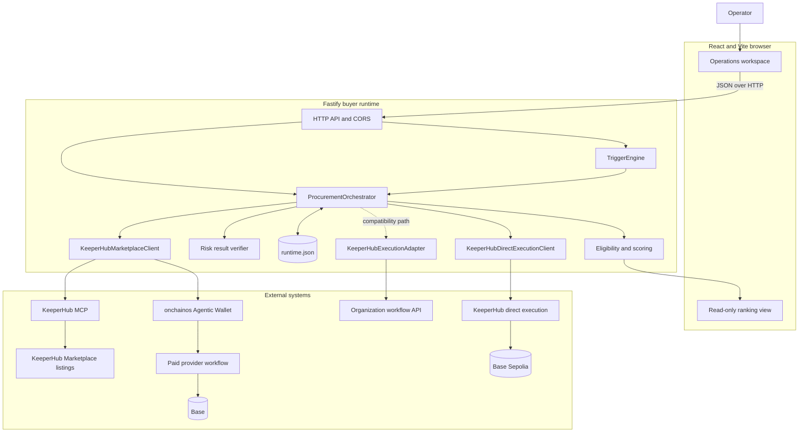
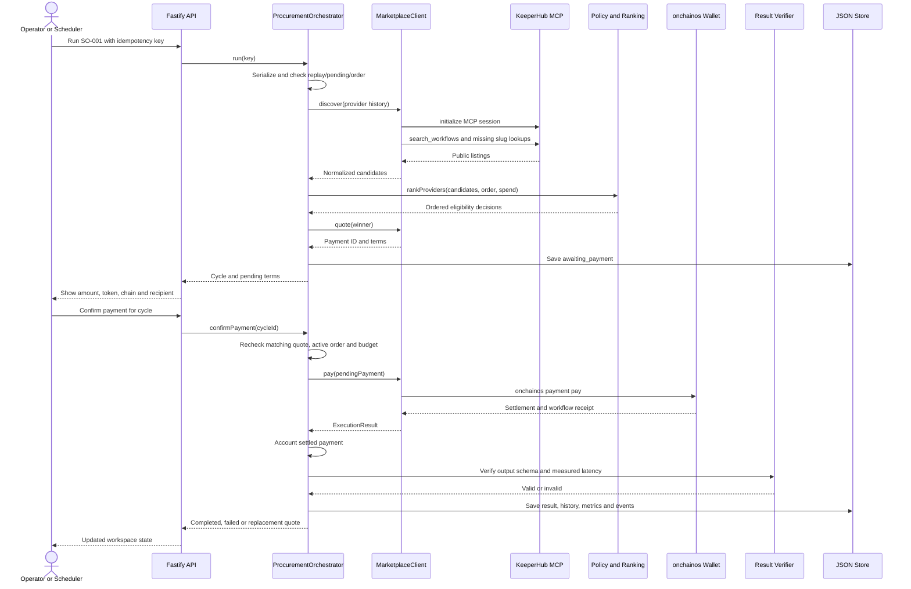
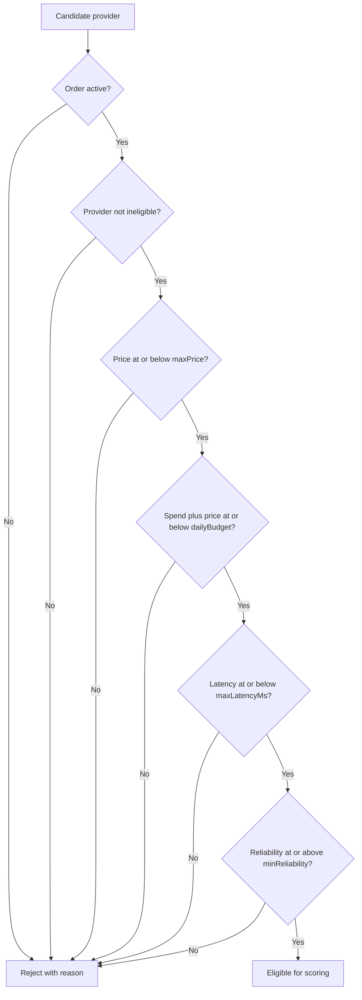
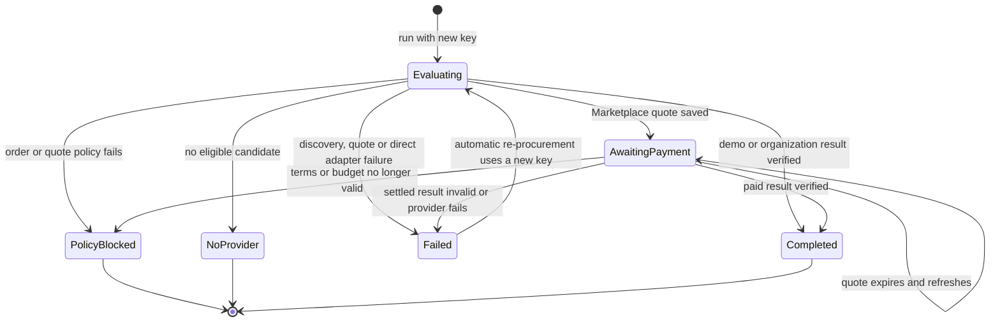
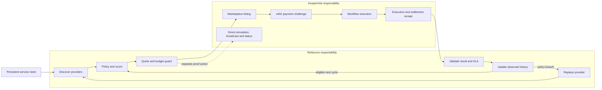
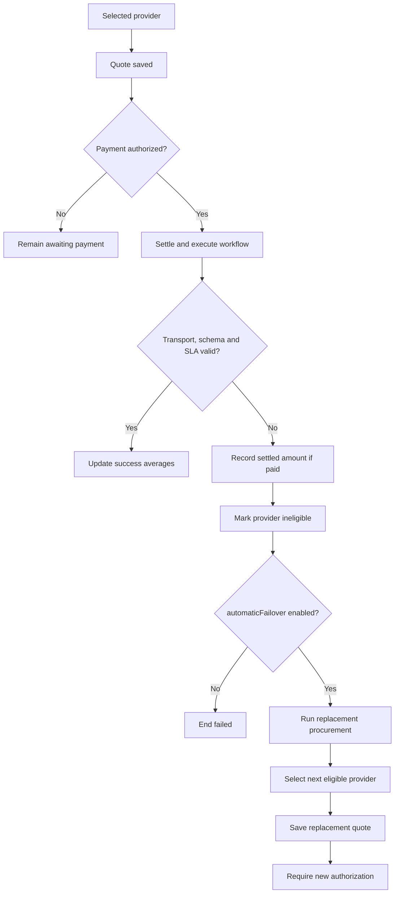
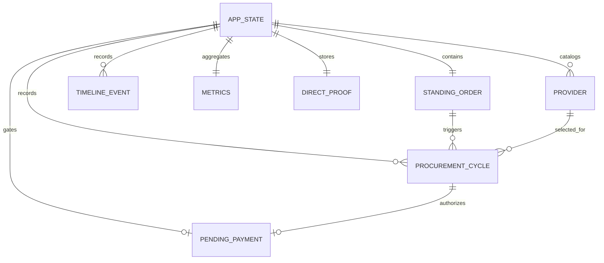
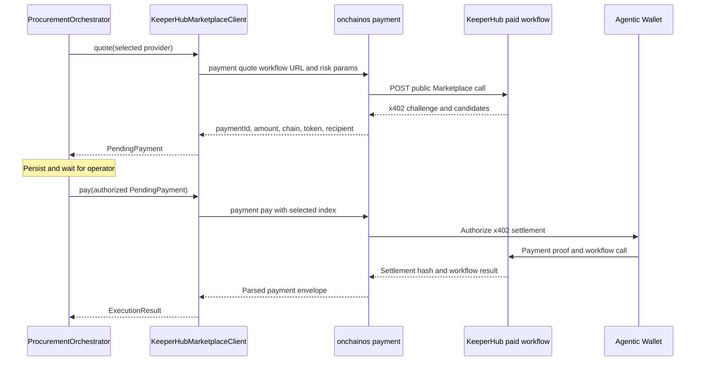
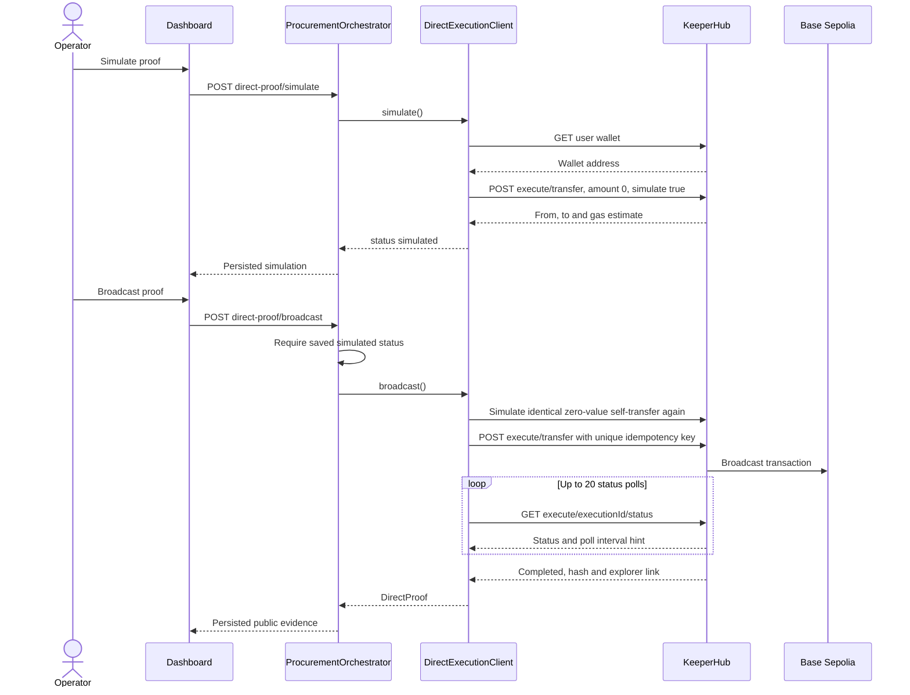
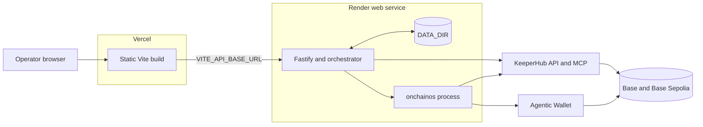

# ReSource Architecture

This document describes the system implemented in this repository: its runtime boundaries, procurement algorithm, state transitions, KeeperHub integrations, persistence, failure behavior and current constraints. It is the detailed companion to the [project README](../README.md).

## 1. Purpose and scope

ReSource is a policy-controlled buyer for agent services. Its durable primitive is a **Standing Order**, not a provider binding. The current order requests transaction-risk intelligence under price, accumulated-spend, latency, reliability, cadence and failover constraints.

The implementation has two execution modes:

- `demo`: deterministic fixtures and a simulated provider result; no wallet or network payment.
- `keeperhub`: live KeeperHub MCP discovery, public Marketplace quoting, x402 payment through the `onchainos` Agentic Wallet CLI, paid result verification and a separate direct-execution proof path.

The codebase is a single TypeScript/npm package. It has a React/Vite browser, a Fastify API and orchestration process, atomic JSON persistence, shared policy functions and no local smart contracts or provider service implementations.

## 2. System overview



The solid procurement path in `keeperhub` mode goes through `KeeperHubMarketplaceClient`. `KeeperHubExecutionAdapter` is a separately implemented organization-workflow path. It is constructed at startup but, while the Marketplace client reports ready, the orchestrator takes the Marketplace quote/payment branch and does not call the organization adapter.

The direct Base Sepolia proof is also separate from provider procurement. It demonstrates KeeperHub-native onchain simulation, broadcast and confirmation; a verified risk result does not automatically cause the direct proof transaction.

## 3. Design principles reflected in code

### Requirement over supplier

`StandingOrder` stores the requirement and policy. `Provider` is a candidate with replaceable Marketplace identity and observed history. Procurement keeps running against the order after a provider becomes ineligible.

### Hard policy before comparative score

`evaluateProvider` returns a rejection reason before calculating a score. An expensive or slow provider cannot compensate for a policy breach with high reliability.

### Deterministic decisions

Candidate scoring contains no LLM call or nondeterministic model output. The same ordered catalog, Standing Order and spend value produce the same ranking.

### Quote before funds

Live procurement resolves a quote into `PendingPayment`, persists `awaiting_payment`, and returns control to the operator. A separate endpoint performs the payment only after checking the order and budget again.

### Evidence before success

A workflow transport success is insufficient. ReSource validates result schema and latency. Live spend is accounted from the payment receipt, while a verified execution is counted only after result validation.

### Fail closed at explicit boundaries

Paused orders, missing integration configuration, missing candidates, quote-price changes, invalid policies and invalid results cannot become completed procurement cycles. Live mode never falls back to demo mode.

### Serialize mutations and persist idempotency

The orchestrator chains state mutations on an in-process promise queue. Each cycle stores a caller- or scheduler-supplied idempotency key, allowing a repeated request to return the existing record.

## 4. Component architecture

| Component | Responsibility | Inputs and outputs | Dependencies | Failure behavior | Source |
| --- | --- | --- | --- | --- | --- |
| React operations UI | Loads state; exposes overview, policy, providers, executions, scheduler, quote authorization and direct-proof controls. | HTTP JSON and operator actions; renders `AppState`. | Fastify API; shared ranking function for display. | Keeps the last loaded state and shows request errors. It does not hold secrets. | `src/App.tsx`, `src/WorkspaceViews.tsx` |
| HTTP API | Maps HTTP operations to orchestrator and scheduler methods; validates route identity/header presence and CORS origin. | `/api/*` requests and JSON responses. | Fastify, `@fastify/cors`. | Returns route-specific `400`, `404`, `409` or `503`; no authentication layer exists. | `server/app.ts` |
| Trigger engine | Polls the order and derives one stable idempotency key per cadence bucket. | `AppState`, clock and poll interval; optional cycle result. | Orchestrator. | Skips paused, unconfigured or payment-pending state. Timer is process-local. | `server/scheduler.ts` |
| Procurement orchestrator | Owns lifecycle, serialized mutation, idempotency, policy decisions, quote/payment state, verification, recovery, metrics and audit events. | Cycle keys and operator commands; returns cloned state and cycle records. | Store, policy functions, execution/Marketplace/direct clients. | Persists terminal policy/no-provider/failure states where implemented; external discovery and wallet errors may return an API error while retaining a safe state. | `server/orchestrator.ts` |
| Policy and scoring | Applies hard eligibility filters, calculates score and ranks candidates. | `Provider[]`, `StandingOrder`, accumulated spend; `ProviderDecision[]`. | Shared domain types only. | Rejected candidates have `score: null` and a stable reason. | `src/lib/procurement.ts` |
| Result verifier | Accepts only the transaction-risk result contract within the latency SLA; recursively unwraps common envelopes. | Provider output and measured latency; boolean. | Standing Order latency. | Invalid output fails the cycle; live paid providers are suspended and may trigger re-procurement. | private functions in `server/orchestrator.ts` |
| Marketplace client | Discovers allowlisted listings, normalizes candidates, resolves x402 quotes and pays through the wallet CLI. | Provider history or pending payment; providers, quote or `ExecutionResult`. | KeeperHub MCP/API, `onchainos`. | Requires at least two configured listings; quote and wallet errors do not create purchase metrics. Expired quotes have a typed recovery path. | `server/marketplace.ts` |
| Organization workflow adapter | Executes a configured KeeperHub organization workflow and waits up to the KeeperHub endpoint timeout for a receipt. | Selected provider and order; `ExecutionResult`. | KeeperHub workflow REST API. | Missing key/workflow ID or non-2xx response throws; no Marketplace payment is implied. | `server/adapters.ts` |
| Demo adapter | Produces a known valid risk result after a short delay. | Selected fixture provider; `ExecutionResult`. | None external. | Always succeeds unless replaced by a test double. | `server/adapters.ts` |
| Direct execution client | Obtains KeeperHub wallet, simulates the proof transfer, broadcasts it and polls terminal status. | Separate simulate/broadcast commands; `DirectProof`. | KeeperHub direct execution API. | Missing key, failed HTTP response or 20 nonterminal polls produces an error; broadcast is gated by saved simulation state in the orchestrator. | `server/direct-execution.ts` |
| State store | Loads and atomically replaces a JSON state file; provides clone-based memory implementation for tests. | Whole `AppState`. | Node filesystem. | Read errors other than missing file propagate; write uses temporary file plus rename. | `server/store.ts` |
| Fixtures and types | Define the initial Standing Order, demo provider catalog, metrics, events and shared contracts. | Static typed values. | None external. | A persisted state with a different execution mode is replaced with mode-appropriate initial state. | `src/data/demo.ts`, `src/types.ts`, `server/fixtures.ts` |

## 5. Startup and mode selection

`server/index.ts` is the composition root:

1. `EXECUTION_MODE=keeperhub` selects `KeeperHubExecutionAdapter`; every other value selects `DemoExecutionAdapter`.
2. KeeperHub mode additionally constructs `KeeperHubMarketplaceClient` and `KeeperHubDirectExecutionClient`.
3. `DATA_DIR/runtime.json` is loaded. State from a different execution mode is discarded rather than mixed with the new mode.
4. `integrationReady` comes from Marketplace readiness when the Marketplace client exists, otherwise from the execution adapter.
5. A process that stopped in `running` or `recovering` restarts in `ready`; `awaiting_payment` remains persisted.
6. `TriggerEngine` starts only when `SCHEDULER_ENABLED` is exactly `true`.
7. Fastify binds to `HOST` and `PORT`.

Marketplace readiness checks the API key, buyer address and at least two slugs. It does not preflight the `onchainos` binary, wallet session, funds or remote listing availability; those fail at their actual call boundaries.

## 6. Full procurement lifecycle



### Demo and organization-workflow variant

When no ready Marketplace client is present, the lifecycle skips quote and confirmation. The orchestrator calls its `ExecutionAdapter` directly. Demo mode counts the successful simulation as a simulated purchase and spend. The organization adapter counts a verified execution but deliberately records zero purchase and spend unless a Marketplace payment receipt exists.

## 7. Provider discovery and selection

### Discovery

`KeeperHubMarketplaceClient.discover`:

1. Opens an MCP session at the API URL with `/api` replaced by `/mcp`.
2. Calls `search_workflows` with `sort: recent` and `workflowType: read`.
3. Retains listings whose `listedSlug` appears in `KEEPERHUB_MARKETPLACE_SLUGS`.
4. Calls `get_workflow_listing` for configured slugs absent from the recent page.
5. Fails if fewer than two configured listings resolve.
6. Normalizes Marketplace price and identifiers, then carries forward locally observed metrics by provider ID or slug.

Newly seen listings begin with reliability `1`, latency `10,000 ms`, zero attempts and `healthy` state. These are initialization values, not Marketplace reputation claims.

### Hard eligibility



Checks are ordered exactly as shown. A candidate receives the first failing reason only.

### Scoring and tie behavior

For each eligible provider:

```text
priceScore       = 1 - price / maxPrice
reliabilityScore = observed reliability
latencyScore     = 1 - observed latency / maxLatency

score = 0.40 * priceScore
      + 0.40 * reliabilityScore
      + 0.20 * latencyScore
```

The result is rounded to three decimals. Eligible providers sort before rejected providers, then by descending score. There is no explicit tie-breaker; modern JavaScript stable sorting preserves the discovered catalog order for equal scores.

### Observed history updates

On a verified live success:

```text
attempts'    = attempts + 1
reliability' = (reliability * attempts + 1) / attempts'
latency'     = round((latency * attempts + observedLatency) / attempts')
state'       = healthy
```

On an injected or paid-result failure:

```text
attempts'         = attempts + 1
previousSuccesses = round(reliability * attempts)
reliability'      = previousSuccesses / attempts'
latency'          = max(latency, 24800)
state'            = ineligible
```

Failure suspension is immediate; the code does not transition through `degraded`. Operator requalification resets reliability to `1`, attempts to `0`, state to `healthy`, and clamps latency to the current maximum SLA.

## 8. Policy and payment guard

Provider eligibility and payment authorization are two related gates:

| Stage | Enforced checks |
| --- | --- |
| Selection | Active order; provider not ineligible; price; accumulated spend; latency; reliability. |
| Quote acceptance | Quoted amount must exactly equal the selected provider's listing price. |
| Payment confirmation | Matching pending cycle; Marketplace ready; provider still present; order active; amount within max price and accumulated-spend limit. |
| Expired quote | Refreshed amount must equal both old amount and provider price; unchanged terms require a second confirmation. |

Policy edits are rejected while payment authorization is pending. Pausing is still allowed, and confirmation then fails because the order is no longer active.

The current budget value is named `dailyBudget`, but enforcement uses cumulative `metrics.spend`; no date partition or midnight reset exists. This is an implementation constraint, not a daily ledger.

## 9. State model

### Procurement cycles



`Evaluating` is an execution phase represented by top-level `AppState.mode=running`, not a persisted `CycleStatus`. A `ProcurementCycle` record is created when the run reaches a terminal decision or Marketplace quote. Existing idempotency keys bypass all transitions and return the stored cycle with `replayed: true`.

### Application and provider state

`AppState.mode` drives the operations UI:

- `ready`: no active work or the previous attempt stopped safely.
- `running`: discovery, execution or payment is in progress.
- `awaiting_payment`: quote terms are persisted for explicit authorization.
- `healthy`: the latest result verified.
- `recovering`: a provider failed and replacement procurement has started.

Provider state is `healthy`, `degraded` or `ineligible`, but current transitions use only `healthy` and `ineligible`.

## 10. Reliability architecture



KeeperHub owns execution-level facts: listing responses, payment/workflow receipts, direct-execution status and transaction evidence. ReSource owns procurement-level interpretation: whether a candidate qualifies, whether terms fit the Standing Order, whether output is acceptable and whether future work should move to another provider.

This boundary does not claim that ReSource retries failed blockchain transactions. Direct execution status is returned by KeeperHub. ReSource's recovery loop operates above that layer by selecting another service provider.

## 11. Failure and recovery



| Failure | Detected by | Implemented response | Retry or recovery owner |
| --- | --- | --- | --- |
| Missing idempotency header | Fastify route | `400`; no cycle. | Caller supplies a key. |
| Repeated cycle key | Orchestrator | Returns the stored cycle; no new discovery or payment. | ReSource idempotency. |
| Another quote is pending | Orchestrator | Rejects a new run. | Operator resolves existing quote. |
| Paused order | Scheduler / orchestrator | Scheduler skips; manual run records `policy_blocked`; payment confirmation throws. | ReSource policy. |
| Marketplace discovery unavailable or fewer than two listings | Marketplace client | Throws, logs discovery failure and resets mode to `ready`; no payment. | Operator/configuration. |
| No eligible provider | Orchestrator | Records `no_provider`, no payment. | Future cycle or operator requalification. |
| Quote price differs from listing | Orchestrator | Records `policy_blocked`; no payment. | ReSource policy. |
| Quote expired | Marketplace client / orchestrator | Refreshes quote. Same price requires new confirmation; changed price is blocked. | ReSource + operator. |
| Wallet command fails | Marketplace client | Stable error is persisted; state returns to `awaiting_payment`; no purchase is recorded unless receipt said paid. | Wallet/operator. |
| Paid output malformed or late | Result verifier | Records paid amount, fails cycle, suspends provider, optionally creates replacement quote. | ReSource procurement recovery. |
| Controlled provider SLA breach before payment | Orchestrator | Cancels pending quote, fails its cycle, suspends provider and sources a replacement. | ReSource. |
| Organization workflow non-success | KeeperHub adapter | Returns failed `ExecutionResult`; orchestrator records failed cycle. | KeeperHub reports; no automatic supplier suspension in this branch. |
| Direct execution not simulated | Orchestrator | Rejects broadcast. | Operator simulates first. |
| Direct execution nonterminal after 20 polls | Direct client | Throws timeout error. | KeeperHub status/operator retry. |
| Process stops while running/recovering | Startup migration | Restores top-level mode to `ready`; persisted cycle details are retained. | Operator inspects audit state. |

## 12. Data model and persistence



### Core records

| Record | Important fields and semantics |
| --- | --- |
| `StandingOrder` | Stable ID/service description; editable cadence and policy; `active` or `paused`. |
| `Provider` | Listing identity, current price, locally observed reliability/latency/attempts and eligibility state. |
| `ProviderDecision` | Ephemeral evaluation containing provider, eligibility, score or rejection reason; not persisted separately. |
| `ProcurementCycle` | Cycle/idempotency/order/provider IDs, timestamps, status, settled amount, x402 marker, KeeperHub execution/hash and error. |
| `PendingPayment` | Cycle/payment/provider IDs, candidate index, amount/token/network/recipient and quote timestamp. One may exist globally. |
| `DirectProof` | Proof status, Base Sepolia identity, sender/recipient, gas estimate, execution ID, hash, explorer link and error. |
| `Metrics` | Cumulative cycles, evaluations, purchases, recoveries, verified executions, spend and calculated savings. |
| `TimelineEvent` | Timestamped UI audit message with info/success/warning/error kind. |
| `AppState` | Schema version `4` and all records above, plus mode and integration readiness. |

### Durability

`JsonStateStore.save` writes the entire state to `runtime.json.<pid>.tmp` and renames it over `runtime.json`. Rename provides atomic replacement on the same filesystem. The file survives a normal restart when `DATA_DIR` is durable. It does not provide row-level transactions, concurrent-writer coordination, history snapshots or cross-instance locking.

`data/runtime.json` is ignored by Git because it contains mutable evidence and operational state. In tests, `MemoryStateStore` clones values on load/save to prevent shared-reference mutation.

Initialization contains a narrow migration path: it adds missing `savings`, normalizes old wallet error text, initializes pending/direct fields, and for pre-v3 KeeperHub state clears legacy purchase/spend claims that lacked payment evidence.

## 13. KeeperHub integration deep dive

### 13.1 MCP and Marketplace discovery

Requests use backend `KEEPERHUB_API_KEY` bearer authentication. Each tool operation initializes an MCP session with protocol version `2025-03-26`, reads `mcp-session-id`, then calls a tool with that session header.

`search_workflows` supplies the recent read-workflow catalog. `get_workflow_listing` fills any configured slug not present in that page. ReSource intentionally allowlists slugs rather than treating every Marketplace result as a candidate.

### 13.2 x402 quote and payment



The command is executed with `execFile`, not a shell. Risk workflow inputs are passed as individual arguments: calldata, contract address, zero value and buyer sender address. Output parsing requires the CLI's `{ ok, data, error }` envelope. Persisted errors deliberately omit raw command lines.

MPP is not present. `paymentProtocol` currently permits only `x402` or null.

### 13.3 Organization workflow adapter

`KeeperHubExecutionAdapter` sends:

```text
POST /workflows/{workflowId}/execute
GET  /workflows/executions/{executionId}/wait?timeoutMs=60000
```

It supplies `service` and `standingOrderId`, adds a random `x-request-id`, handles either direct or `{ data }` response envelopes, and captures the first returned transaction hash. This path proves organization workflow execution, not Marketplace purchase. It is useful when the orchestrator is composed without a ready Marketplace client; the standard `server/index.ts` KeeperHub composition favors Marketplace procurement.

### 13.4 Direct onchain execution



The chain ID is fixed to Base Sepolia `84532`. Sender and recipient are the KeeperHub wallet returned by `/user/wallet`; amount is string `"0"`. The client waits at least 250 ms and otherwise honors `X-Poll-Interval-Hint`. It accepts only `completed` or `failed` as terminal statuses.

The confirmed repository evidence is linked in the [README execution proof](../README.md#live-execution-proof).

## 14. Idempotency and concurrency

There are two separate idempotency mechanisms:

- **Procurement cycle:** the API requires `idempotency-key`; the scheduler derives `schedule:<orderId>:<intervalBucket>`. The orchestrator checks persisted cycles before doing any work.
- **Direct broadcast:** the client sends `Idempotency-Key: resource-proof-<uuid>` to KeeperHub.

The orchestrator's promise queue prevents overlapping state mutations inside one Node process. It also prevents two in-process confirmations from concurrently consuming the same pending quote. This is not a distributed lock: two server instances pointed at the same or separate JSON files can race.

The Marketplace quote's `paymentId` is persisted, and only one pending payment exists globally. A wallet failure leaves it pending for operator inspection/retry. An expired ID is replaced with a fresh one and requires confirmation again.

## 15. Observability and audit trail

Fastify structured logging is enabled for HTTP requests. Application observability is stored in `AppState` and rendered in the workspace:

- cycle ID and caller/scheduler idempotency key;
- selected provider and terminal cycle status;
- KeeperHub workflow/payment execution ID;
- x402 transaction hash, protocol and settled amount;
- direct-proof execution ID, gas estimate, transaction hash and explorer link;
- provider attempts, observed reliability, moving-average latency and state;
- aggregate cycles, evaluations, purchases, recoveries, executions, spend and savings;
- timestamped decision/rejection/payment/recovery timeline events.

The system does not currently emit traces, Prometheus metrics or a separately immutable append-only audit log. `TimelineEvent` records are mutable JSON state despite the UI label “Immutable audit history.” External explorer records and KeeperHub execution IDs are the independent evidence anchors.

## 16. Security model

### Implemented controls

- KeeperHub credentials are read only from server environment variables and are never part of `AppState`.
- `.env` and runtime state are ignored by Git.
- The browser receives quote terms but not wallet credentials; payment is performed by the backend CLI process.
- Policy input ranges are validated server-side. Policy edits are locked while a quote is pending.
- CORS can restrict browser origins through `FRONTEND_ORIGIN`.
- `execFile` passes wallet arguments without shell interpolation.
- Raw wallet command output is mapped to stable errors before persistence.
- Payment accounting requires a receipt reporting `paid`; result validation is independent from settlement accounting.
- Direct broadcast requires saved simulation state and a separate operator action.

### Trust boundaries and gaps

- The API has no operator authentication, authorization, CSRF token or rate limit. CORS is not access control for non-browser clients.
- Marketplace listing names, prices, schemas and provider outputs are external inputs. ReSource allowlists slugs, enforces numeric price policy and validates the risk result, but does not verify code provenance.
- `onchainos` and its wallet session are trusted backend dependencies. The app does not constrain wallet policy beyond quote display and ReSource's amount checks.
- The direct client is code-restricted to a zero-value self-transfer on Base Sepolia, but no generalized transaction allowlist exists because arbitrary direct actions are not implemented.
- JSON state is unencrypted at rest and exposes payment hashes/recipient data through `/api/state`.

## 17. Deployment architecture



`vercel.json` defines a Vite build to `dist`. `render.yaml` runs `npm ci && npm run build`, starts `npm start`, checks `/api/health`, pins Node `24.15.0`, and defaults to demo mode with the scheduler disabled.

For split deployment, `VITE_API_BASE_URL` points the built browser to Render and `FRONTEND_ORIGIN` allows the Vercel origin. A Render persistent disk can be mounted at `/var/data` and selected with `DATA_DIR=/var/data`. Without it, runtime state resets with an ephemeral instance.

KeeperHub mode additionally assumes the `onchainos` executable and wallet authentication are available in the server runtime. The provided Render definition does not install or configure that live-wallet dependency; it is a demo-mode deployment definition.

## 18. Repository map

| Architectural concern | Path |
| --- | --- |
| Composition root and mode selection | `server/index.ts` |
| HTTP boundary and routes | `server/app.ts` |
| Procurement lifecycle and verification | `server/orchestrator.ts` |
| Eligibility, score and provider failure math | `src/lib/procurement.ts` |
| Shared domain/state contracts | `src/types.ts` |
| Initial order/provider fixtures | `src/data/demo.ts` |
| Initial persisted-state shape | `server/fixtures.ts` |
| KeeperHub MCP, Marketplace and x402 | `server/marketplace.ts` |
| Demo and organization-workflow adapters | `server/adapters.ts` |
| KeeperHub direct execution | `server/direct-execution.ts` |
| Interval scheduler | `server/scheduler.ts` |
| JSON and memory persistence | `server/store.ts` |
| React orchestration and API client | `src/App.tsx` |
| Orders/providers/executions/settings views | `src/WorkspaceViews.tsx` |
| Policy and ranking tests | `src/lib/procurement.test.ts` |
| Lifecycle and Marketplace tests | `server/orchestrator.test.ts` |
| API boundary tests | `server/app.test.ts` |
| Scheduler/idempotency tests | `server/scheduler.test.ts` |
| Runtime configuration template | `.env.example` |
| Web/API deployment configuration | `vercel.json`, `render.yaml` |
| Focused KeeperHub notes | `docs/KEEPERHUB.md` |
| Integration friction evidence | `docs/KEEPERHUB_FRICTION_LOG.md` |

## 19. Architectural decisions

### Deterministic score instead of model-based selection

Price, reliability and latency are scalar policy inputs with auditable weights. A deterministic function lets an operator reproduce why Sentinel or Atlas won and makes failure tests exact. An LLM would add cost and nondeterminism without improving this decision surface.

### Local observed history instead of accepting advertised reliability

Marketplace discovery supplies listing identity and price. ReSource overlays its own attempts, result latency, reliability and eligibility. The buyer therefore changes supplier decisions based on outcomes it observed, although fresh providers currently receive optimistic initialization values.

### Policy separate from scoring

Hard ceilings and floors represent authority: they must not be traded away. Scoring compares only providers that already satisfy that authority. The same separation allows the amount/order budget to be checked again at payment time.

### Explicit payment authorization

Scheduler-driven purchasing would be unsafe with the current single-process store and unauthenticated API. Persisting quotes creates an inspectable point between autonomous selection and funds movement. Expired quotes cannot silently reuse prior consent.

### KeeperHub execution below ReSource procurement

KeeperHub returns workflow and transaction execution evidence. ReSource does not duplicate KeeperHub transaction status machinery; it uses receipts to update supplier eligibility and decide whether to source another provider.

### Whole-state JSON for the product slice

One state document keeps the demo reproducible and makes atomic local persistence straightforward. It also limits the app to one process, one order and cumulative metrics; a transactional ledger/database is required for broader deployment.

### Direct proof isolated from procurement

The hackathon proof path is intentionally a fixed, separately authorized zero-value action. This avoids implying that a risk-service result already authorizes arbitrary onchain writes. A future policy-derived action pipeline needs its own action schema and wallet permission model.

## 20. Current constraints

- One `AppState` contains one Standing Order and at most one pending quote.
- The service category and verifier are fixed to transaction-risk intelligence.
- At least two allowlisted Marketplace slugs are required in live discovery.
- “Daily” budget is cumulative spend without date rollover or quote-time reservation.
- Provider suspension is binary and immediate; `degraded` is not used.
- Catalog order is the implicit tie-breaker.
- Replacement selection is automatic, but each Marketplace payment remains operator-authorized.
- Paid-but-invalid results can consume budget before re-procurement, as x402 settles before result verification.
- JSON storage, promise serialization and the scheduler are single-process mechanisms.
- Scheduler enablement toggled through the API does not survive restart.
- API access is unauthenticated and must not be exposed as a live spending control plane.
- The deployed Render configuration supports demo mode; live wallet CLI provisioning is not encoded.
- Direct execution supports only Base Sepolia and one proof action.
- MPP, smart contracts, database models, multi-tenant orders and provider-side code are absent from this repository.
- Tests mock KeeperHub and wallet boundaries; there is no automated live integration suite.

## 21. Future architecture

The next architecture should preserve the current policy/payment separation while replacing the infrastructure around it:

1. Store orders, dated spend entries, provider observations, quotes and cycle transitions in a transactional database with uniqueness on idempotency keys.
2. Add authenticated operator/service identities, role-based payment authorization and wallet policy scopes.
3. Move cadence evaluation to a durable job queue; reserve budget when a quote is created and release it when the quote expires.
4. Register service-specific input builders and result verifiers so additional provider categories do not weaken validation.
5. Model provider states and cooldown/requalification explicitly, including multiple observations rather than immediate permanent suspension.
6. Introduce a typed post-verification action policy before connecting procurement results to generalized KeeperHub direct execution.

These are future directions. They are not described as shipped behavior in the [README](../README.md).
